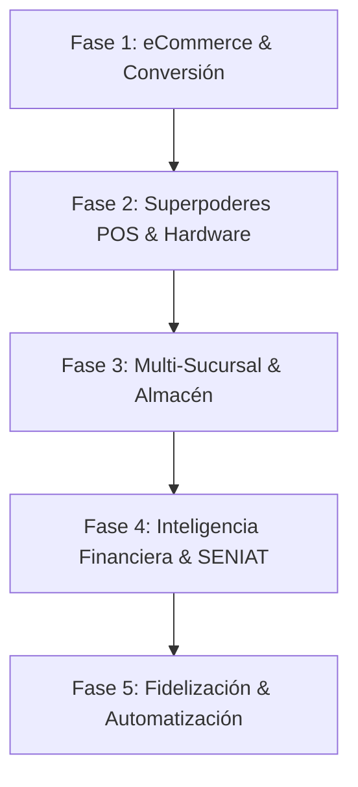

# 🚀 PLAN MAESTRO DE ACTUALIZACIONES: URBANSTEP (ERP / POS & ECOMMERCE)

> **Documento Estratégico y Técnico de Arquitectura**  
> **Preparado para:** UrbanStep Retail & eCommerce  
> **Estado del Sistema:** Núcleo Operativo Estable (Ventas, Inventario Multitalla/Multicolor, Proveedores, Reportes, Catálogo Web y Supabase Sincronizado).

---

## 🎯 Visión General del Proyecto
UrbanStep ha completado con éxito su fase fundacional: sincronización en tiempo real de variantes de calzado (tallas y colores), vinculación con proveedores, terminales de caja, carrito con control de stock estricto y un catálogo visualmente estilizado tipo estudio de calzado.

El siguiente paso es transformar UrbanStep en una **plataforma omnicanal de alto rendimiento**, diseñada para escalar ventas físicas y digitales, blindar las finanzas y automatizar la logística de calzado.

---

## 📊 Matriz de Fases y Prioridades

---

## 🛍️ FASE 1: eCommerce Storefront & Experiencia de Compra (Mayor Conversión)
*Objetivo: Convertir visitantes en compradores recurrentes y automatizar las ventas online.*

### 1.1 Ficha de Producto Dedicada (PDP - `/producto/:slug`)
- **Visualizador 360° y Galería de Alta Resolución**: Múltiples fotos por modelo (lateral, frontal, suela, puesto en modelo).
- **Selector Inteligente de Talla & Guía de Medidas Interactiva**: Conversor automático EU / US / CM y recomendación según el tipo de empeine.
- **Micro-indicadores de Escasez**: "🔥 Solo quedan 2 pares en talla 41" para disparar la urgencia de compra (FOMO).
- **Reseñas y Fotos de Clientes**: Sistema de calificación con estrellas y fotos reales subidas por clientes.

### 1.2 Portal del Cliente y Autenticación
- **Inicio de sesión social**: Acceso con 1-clic con Google o Email (vía Supabase Auth).
- **Panel de Autogestión**:
  - Historial de pedidos y facturas descargables.
  - Rastreo de envíos en tiempo real con estados claros (*Empacando, En Ruta, Entregado*).
  - Libreta de direcciones guardadas para agilizar futuras compras.
  - Lista de deseos (Wishlist) de sneakers favoritos.

### 1.3 Pasarelas de Pago Automatizadas
- **Pago Móvil C2P / Verificación Automática**: Validación instantánea de transferencias bancarias locales sin esperar chequeo manual humano.
- **Pagos Internacionales & Cripto**: Integración con Binance Pay (USDT) y Stripe / PayPal para ventas a clientes en el extranjero.
- **Motor de Cupones y Promociones Flash**:
  - Cupones de descuento porcentuales o monto fijo (`BIENVENIDA10`, `BLACKFRIDAY`).
  - Promociones automáticas tipo "2x1 en modelos seleccionados" o "Envío gratis a partir de $80".

---

## ⚡ FASE 2: Superpoderes para el Punto de Venta (POS & Caja Física)
*Objetivo: Cobrar en menos de 15 segundos por cliente y blindar el flujo de efectivo.*

### 2.1 Impresión Térmica Directa ESC/POS (Sin Diálogo del Navegador)
- **Web Bluetooth & Web USB API**: Envío de recibos directo a impresoras térmicas de 58mm y 80mm en milisegundos.
- **Tickets Personalizados**: Logotipo de UrbanStep, código QR para factura digital, políticas de cambio de calzado y desglose multimoneda ($ / Bs).

### 2.2 Pistola de Código de Barras y Generador de Etiquetas
- **Lectura Ultra-Rápida**: Soporte nativo para escáner USB/Bluetooth y lector con cámara web/móvil (`html5-qrcode`).
- **Creador de Etiquetas Adhesivas**: Generación e impresión masiva de stickers para las cajas de zapatos con código de barras EAN-13/Code128, nombre del modelo, color, talla y precio de venta.

### 2.3 Arqueo y Cierre Ciego de Caja (Control Antirrobo)
- **Cierre Ciego**: El cajero ingresa los billetes y montos que contó físicamente antes de que el sistema le revele el total esperado. Evita cuadres forzados.
- **Bóveda Multidivisa**: Control separado por método de pago:
  - Efectivo USD (desglose por denominación de billetes).
  - Efectivo Bs.
  - Punto de Venta / Débito.
  - Pago Móvil.
  - Zelle / Binance.
- **Reporte de Diferencias**: Alerta automática al gerente de faltantes o sobrantes por turno de cajero.

### 2.4 Modo Offline-First (PWA)
- **Caja Ininterrumpida**: Si la tienda se queda sin internet, el cajero puede seguir cobrando utilizando almacenamiento local (IndexedDB).
- **Cola de Sincronización Automática**: Al regresar la conexión, las ventas se suben automáticamente a Supabase sin duplicar registros.

---

## 📦 FASE 3: Multi-Sucursal y Logística de Almacén (Escalabilidad)
*Objetivo: Controlar inventario de varias tiendas físicas y depósito central sin discrepancias.*

### 3.1 Soporte Multi-Sucursal (Multi-Store)
- Asignación de stock por ubicación física: *Tienda Principal*, *Sucursal Centro*, *Depósito Central*.
- Consulta instantánea en caja: Si una talla no está en la tienda actual, el vendedor puede ver en 1 segundo si está en otra sucursal y solicitar el traslado.

### 3.2 Órdenes de Traslado y Recepción Ciega
- Módulo de despachos entre depósitos con estado: *En Tránsito* -> *Recibido*.
- Validación de recepción con conteo de pares para evitar pérdidas en transporte.

### 3.3 Reabastecimiento Inteligente de Calzado
- Algoritmo que analiza la velocidad de venta semanal por marca/modelo.
- Sugerencia automática de pedido de compra al proveedor cuando un modelo o talla clave cae por debajo del umbral de seguridad.
- Generación de Orden de Compra en PDF / WhatsApp lista para enviar al proveedor con 1 clic.

### 3.4 Gestión de Devoluciones y Mermas (Garantías)
- Registro de cambios de calzado por talla o fallas de fábrica.
- Reingreso al stock vendible o pase a lote de garantía/proveedor.

---

## 📈 FASE 4: Finanzas, Costos Reales y Cumplimiento Fiscal
*Objetivo: Conocer con exactitud el margen neto de ganancia de cada par de zapatos vendido.*

### 4.1 Costo Promedio Ponderado / FIFO por Lote
- Cálculo del costo real de compra considerando gastos de flete e impuestos de importación.
- Margen bruto y neto exacto por venta, por marca y por categoría.

### 4.2 Control de Comisiones por Vendedor
- Asignación de cajero/asesor de ventas por factura.
- Reporte quincenal de comisiones acumuladas por volumen o margen vendido.

### 4.3 Libro de Ventas y Facturación Fiscal (SENIAT / e-Invoice)
- Formato fiscal estandarizado con número de control, base imponible, exento e IVA (16%).
- Exportación mensual a Excel en formato Libro de Ventas SENIAT.

### 4.4 Roles y Permisos Granulares (RBAC)
- **Cajero**: Solo cobra, consulta stock y emite recibos. No ve costos de compra ni márgenes de ganancia.
- **Supervisor**: Autoriza descuentos especiales, anulaciones de venta y devoluciones mediante PIN de seguridad.
- **Administrador**: Acceso total a reportes, proveedores, finanzas y configuración del sistema.

---

## 🤖 FASE 5: Automatización y Retención de Clientes (Marketing)
*Objetivo: Vender más a los clientes existentes sin gastar en publicidad.*

### 5.1 Carritos Abandonados por WhatsApp
- Detección de clientes que armaron un pedido en la web pero no finalizaron.
- Envío de mensaje automático amigable vía WhatsApp con enlace directo para retomar su compra.

### 5.2 Alertas de "Avisarme cuando esté disponible mi talla"
- Los clientes dejan su WhatsApp o email en modelos agotados.
- Al cargar nuevo stock en el inventario, el sistema les notifica de inmediato automáticamente.

### 5.3 UrbanStep VIP Club (Puntos y Fidelización)
- Acumulación de puntos por cada dólar comprado en tienda física o web.
- Niveles de membresía (*Rookie, Streetwear Fan, Sneakerhead VIP*) con acceso anticipado a lanzamientos exclusivos y regalos en su cumpleaños.

---

## 🛠️ Resumen de Implementación Técnica Sugerida

| Característica | Tecnología Recomendada | Impacto | Complejidad |
| :--- | :--- | :---: | :---: |
| **Impresión Térmica Directa ESC/POS** | Web Bluetooth API / Web USB | 🟢 Alto | Media |
| **Lector Códigos de Barras / QR** | `html5-qrcode` / Scanner USB | 🟢 Alto | Baja |
| **Generador de Etiquetas de Calzado** | `jsbarcode` + Plantilla CSS print | 🟢 Alto | Baja |
| **Arqueo Ciego Multimoneda** | Módulo React + Modal Cuadre | 🟢 Alto | Media |
| **Página de Detalle 360° / PDP** | Componente Modal/Página en Vite | 🟢 Alto | Media |
| **Autenticación Clientes Web** | Supabase Auth (OAuth Google) | 🟡 Medio | Media |
| **Multi-Sucursal** | Tablas relacionales en Supabase | 🟡 Estratégico | Alta |
| **Pasarela Pago Móvil C2P** | API Bancaria / Webhook | 🟢 Alto | Media |

---

> 💡 **Recomendación Inmediata de Chief**:  
> Iniciar la siguiente iteración con **Impresión Térmica Directa + Generador de Etiquetas con Código de Barras**, seguido de la **Ficha de Detalle de Producto (PDP) con Galería en el eCommerce**. Esto aumentará drásticamente la velocidad operativa en mostrador y multiplicará las conversiones online de UrbanStep.
